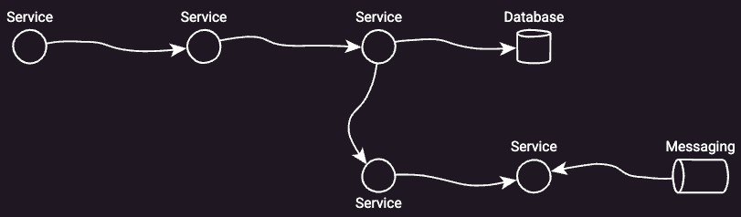
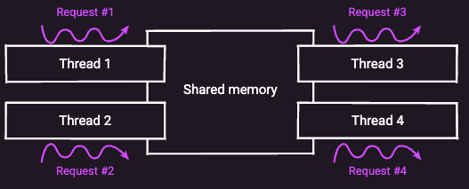
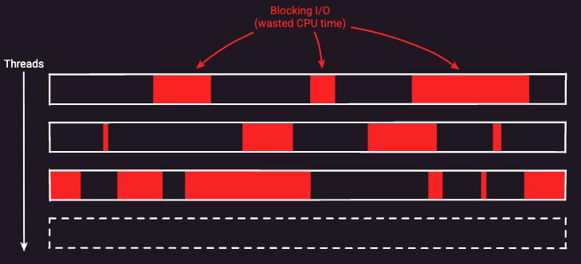
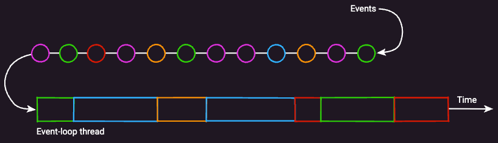
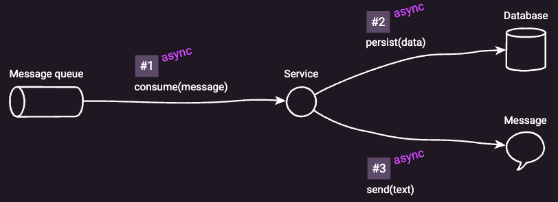
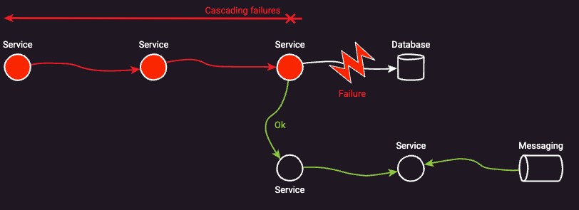
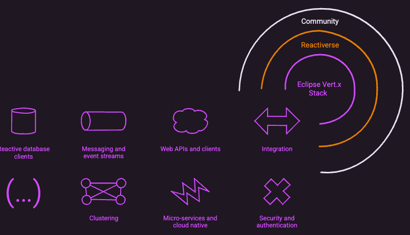

# Eclipse Vert.x & reactive

* Eclipse Vert.x
  * == 💡tool-kit -- for -- building **reactive** applications | JVM💡
    * ❌!= framework❌
      * == NOT magic
    * == MULTIPLE reactive modules 
      * _Examples:_ comprehensive web stack, reactive database drivers, messaging, event streams, clustering, metrics, distributed tracing ...
  * use cases
    * write 
      * cloud native
      * [twelve-factor](https://12factor.net/) app

* Reactive applications
  * are
    * if workloads grow -> **scalable**
    * if failures arise -> **resilient** 
    * **responsive**
      * == keeps latency under control
      * -- by --
        * making efficient usage of system resources
        * protecting itself from errors

## | ORIGIN, there were threads

* concurrency,
  * classic approach
    * -- via -- threads

* MULTIPLE threads 
  * live | 1! **process**
  * perform **concurrent** work
  * **share** the SAME memory space
  * use cases
    * MOST application & service development frameworks
    * ⚠️moderated workloads⚠️

* model / 1 thread / connection
  * reassuring
    * Reason:🧠developers can rely on traditional **imperative style** code🧠

## Multi-threading: "simple" BUT limited

* limitations
  * ⚠️workload grow⚠️
    * [C10k problem](https://en.wikipedia.org/wiki/C10k_problem)
    * Reason:🧠your OS kernel suffer -- due to -- too much context switching work | in-flight requests🧠
    * threads status groups
      * **blocked**
        * Reason:🧠they are waiting on I/O operations to complete🧠
      * **ready** -- to -- handle I/O results
      * middle of doing CPU-intensive tasks
    * thread creation: few milliseconds

  

## Asynchronous programming: scalability & resource efficiency

* **asynchronous I/O**
  * allows
    * processing MORE concurrent connections / less threads
  * if | thread, I/O operation occurs -> 
    * move to another task / ready to progress
    * | it's ready, resume the initial task later
      * -- via -- worker threads & APIs

* Vert.x MULTIPLEXES concurrent workloads -- via -- **event loops**
  * code / runs | event loops
    * should NOT perform processing
      * blocking I/O, OR
      * lengthy 

## Pick the best asynchronous programming model -- for -- your problem domain

* asynchronous programming
  * requirements
    * MORE efforts

* Vert.x
  * 's core
    * **callbacks**
    * **promises/futures**
      * uses
        * model -- for -- chaining asynchronous operations
  * supports
    * MULTIPLE asynchronous programming models

* _Examples of reactive programming:_
  * [RxJava](https://github.com/ReactiveX/RxJava)
  * [Kotlin coroutines](https://kotlinlang.org/docs/reference/coroutines-overview.html)

## Don't let failures ruin responsiveness

* Failures
  * happen ALL the time
  * _Examples:_ go down a database, network, some service

* Vert.x
  * provides
    * tools / keep latency under control
    * **circuit breaker**

## rich ecosystem

* _Eclipse Vert.x stack_
  * == MULTIPLE DIFFERENT modules

    

* [The Reactiverse](https://reactiverse.io)
  * == larger community /
    * provider
      * MORE client & modules
* [Vert.x Awesome](https://github.com/vert-x3/vertx-awesome)
